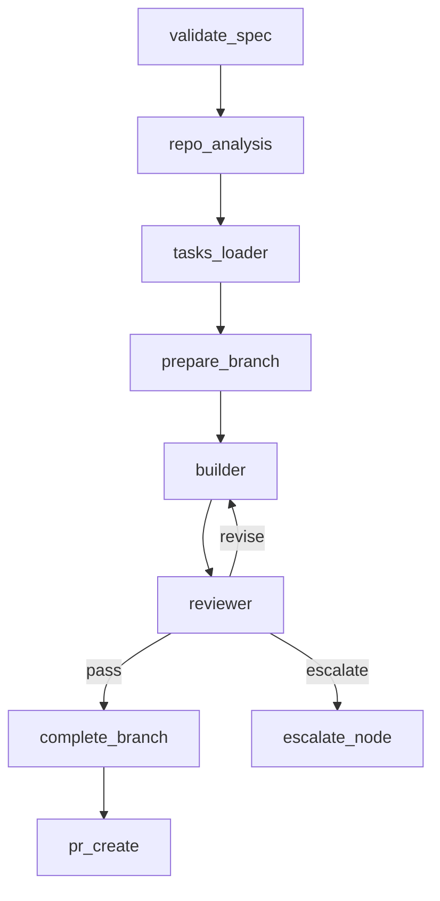

# Pipeline Phases

Bureau's pipeline is a LangGraph directed graph. Each node has a single responsibility, persists its output to the run checkpoint before exiting, and passes typed state to the next node. Runs are resumable from any node boundary.

---

## Nodes

### :octicons-shield-24: validate_spec

Reads `spec.md` and confirms it is executable: P1 user stories present, no `[NEEDS CLARIFICATION]` markers, functional requirements (`FR-NNN`) defined. Rejects specs that would cause the Builder to infer intent rather than fulfil a contract.

### :octicons-search-24: repo_analysis

Reads `.bureau/config.toml` from the target repo and populates `RepoContext` — the language, install/lint/build/test commands, model selection, and loop limits that govern the rest of the run.

### :octicons-list-unordered-24: tasks_loader

Reads `tasks.md` from the spec folder. Parses the dependency-ordered task list into the state that the Builder will consume. Does not generate tasks — they must already exist as a Spec Kit artifact.

### :octicons-git-branch-24: prepare_branch

Creates the feature branch (`feat/<spec-name>-<run-id>`) before any implementation begins. This mirrors how a developer picks up a story: branch first, then work. All Builder commits land on this branch.

### :octicons-tools-24: builder

The deepagents agent. Works through the task list phase by phase using filesystem tools and bundled ASDLC skills (build / test / ship). After each phase passes lint → build → test, the Builder commits with a phase-scoped message. If a phase fails after `max_builder_attempts`, the Builder escalates.

### :octicons-eye-24: reviewer

Independent LLM pass. Re-executes the full pipeline against the committed branch, reads every file changed since `main`, and produces a structured verdict against the spec's functional requirements and the constitution. Returns `pass`, `revise`, or `escalate`. Cannot be influenced by the Builder's context.

### :octicons-git-commit-24: complete_branch

Final commit and push. If the Builder committed all work incrementally (phase-end commits), the tree is already clean and this node skips the commit and pushes the branch as-is. If uncommitted changes remain, it stages and commits them before pushing.

### :octicons-git-pull-request-24: pr_create

Opens the pull request using `gh pr create` with a structured run summary attached. Only runs on Reviewer `verdict=pass`. The PR URL is the terminal output of a successful bureau run.

### :octicons-alert-24: escalate_node

Writes a structured escalation record — what happened, what is needed, what options exist — and pauses the run. The run remains checkpointed and resumable. The developer provides a response and calls `bureau resume <run-id> --response "..."`.
