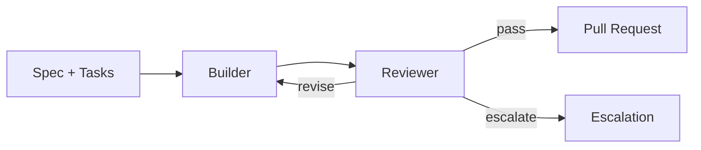

# The RALPH Loop

The **RALPH Loop** — Recursive Autonomous Loop of Patch and Harden — is the persistence pattern at the heart of bureau. It is bureau's implementation of the [RALPH Loop pattern](https://asdlc.io/patterns/ralph-loop) defined in ASDLC.

The core insight: treat test failures as feedback, not termination. The agent iterates until *external verification* confirms success — not until the agent believes it is done.

---

## How It Works in Bureau

**Builder** receives the task list from `tasks.md` and implements phase by phase. After each phase passes its local verification gate (lint → build → test), the Builder commits the work. If the test suite fails after the configured number of attempts, the Builder escalates rather than loop indefinitely.

**Reviewer** runs independently. It re-executes the full pipeline, reads every changed file, and scores the implementation against the spec's functional requirements and the project constitution. It returns one of three verdicts:

| Verdict | Meaning | Next step |
|---|---|---|
| `pass` | All FRs met, pipeline clean | PR created |
| `revise` | One or more FRs unmet or pipeline failing | Builder gets another round |
| `escalate` | Cannot be resolved autonomously | Run pauses, developer notified |

Each full Builder → Reviewer cycle is one **RALPH round**. The maximum number of rounds is set by `max_rounds` in `.bureau/config.toml` (default: 3).

---

## Why External Verification Matters

The Reviewer is a separate LLM call with a structured output schema — it does not share context with the Builder and cannot be influenced by the Builder's self-assessment. Research shows LLMs reliably fail to self-correct without objective external feedback; the Reviewer's independence is the mechanism that prevents the Builder from hallucinating success.

The pipeline re-execution (not the Builder's last test run) is the verification source of record. If tests were passing in the Builder's context but fail when re-run by the Reviewer, the Reviewer's result stands.

---

## Guardrails

Bureau bounds the loop on two axes:

- **`max_builder_attempts`** — retries within a single round before the Builder escalates to the Reviewer
- **`max_rounds`** — full RALPH cycles before bureau escalates to the developer with `RALPH_ROUNDS_EXCEEDED`

Unbounded iteration is an anti-pattern. A run that loops without progress burns tokens without producing value. When the loop limit is reached, bureau surfaces a structured escalation describing what was tried and what remains unmet — giving the developer the information needed to either fix the spec or resume with additional context.
