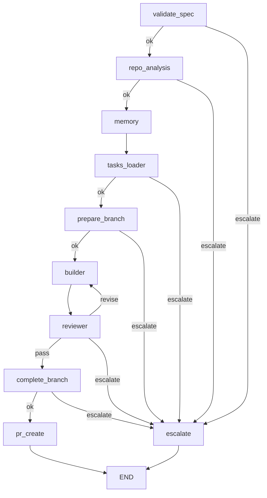

# Development

Internals, architecture, and local dev setup for working on bureau itself.

---

## Module layout

```
bureau/
├── cli.py              ← Typer CLI: run, resume, list, show, abort, prune, init
├── graph.py            ← LangGraph pipeline: nodes, edges, routing, checkpointer
├── state.py            ← State dataclasses: Phase, RepoContext, Escalation, RunRecord
├── config.py           ← BureauConfig, load_bureau_config(), load_constitution()
├── events.py           ← emit(), phase() context manager, OutputFormat, CloudEvents
├── run_manager.py      ← Run lifecycle: create, get, list, resume, abort, prune
├── spec_parser.py      ← parse_spec() → ParsedSpec with stories and FRs
├── models.py           ← BuildAttempt, PipelineResult, PipelinePhase
├── memory.py           ← Memory: per-run JSON scratchpad at ~/.bureau/runs/<id>/memory.json
├── kafka_publisher.py  ← Opt-in Kafka producer; no-op when BUREAU_KAFKA_BOOTSTRAP_SERVERS unset
├── repo_analyser.py    ← Reads .bureau/config.toml → RepoContext
├── nodes/              ← One file per pipeline node
├── personas/           ← Builder and Reviewer LLM logic
├── tools/              ← pipeline.py: run_pipeline() → PipelineResult
├── skills/             ← Vendored ASDLC skills (build/test/ship/review SKILL.md files)
└── data/               ← constitution.md, env.example
```

---

## Pipeline architecture

The pipeline is a `StateGraph(dict)` compiled with a `SqliteSaver` checkpointer. Every node receives the full state dict and returns a partial update. Routing is via `_route` in the state dict — each conditional edge reads it and dispatches accordingly.



The `memory` node is a lightweight pass-through that initialises the per-run JSON scratchpad and writes a spec summary before `tasks_loader` runs.

---

## Node reference

| Node | Reads from state | Writes to state | Routes |
|---|---|---|---|
| `validate_spec` | `spec_path` | `spec`, `spec_text` | `ok` / `escalate` |
| `repo_analysis` | `repo_path` | `repo_context` | `ok` / `escalate` |
| `memory` | `run_id`, `spec` | — | always `ok` |
| `tasks_loader` | `spec_folder`, `tasks_path`, `repo_context` | `task_plan`, `plan_text` | `ok` / `escalate` |
| `prepare_branch` | `run_id`, `spec_path`, `repo_path` | `branch_name` | `ok` / `escalate` |
| `builder` | `task_plan`, `spec_text`, `plan_text`, `repo_context`, `ralph_round`, `build_attempts` | `build_attempts`, `builder_attempts` | always → `reviewer` |
| `reviewer` | `spec_text`, `repo_path`, `repo_context`, `ralph_round`, `build_attempts` | `ralph_rounds`, `reviewer_findings`, `ralph_round`, `builder_attempts` | `pass` / `revise` / `escalate` |
| `complete_branch` | `branch_name`, `repo_path`, `run_id`, `spec_path` | — | `ok` / `escalate` |
| `pr_create` | `run_id`, `repo_path`, `reviewer_findings`, `ralph_rounds` | `run_summary` | always → END |
| `escalate` | `escalations` | `run_summary` | always → END |

---

## Local development

```sh
git clone https://github.com/fancy-bread/bureau.git
cd bureau
uv pip install -e ".[dev]"
```

### Make targets

```sh
make ci           # lint + unit + integration tests (mirrors CI)
make lint         # ruff check .
make test         # pytest tests/unit tests/integration -x
make test-cov     # pytest with coverage report; fails below 80%
make test-e2e     # end-to-end tests (requires live ANTHROPIC_API_KEY)
make docs-serve   # MkDocs dev server at localhost:8000
make docs-build   # Build docs to site/
```

### Local Kafka

```sh
make bureau-kafka-up    # start Redpanda container on port 9092
make bureau-kafka-down  # stop and remove
```

### Running bureau locally against a test repo

```sh
# Python
make test-kafka-smoke

# TypeScript
make test-kafka-smoke-ts

# .NET
make test-kafka-smoke-dotnet
```

These targets set `BUREAU_KAFKA_BOOTSTRAP_SERVERS=localhost:9092` and point at the respective test repo spec. Requires a local Kafka instance (`make bureau-kafka-up`) and a valid `ANTHROPIC_API_KEY`.

---

## Tests

```
tests/
├── unit/          ← Fast, no I/O: config, spec parser, builder extraction, callbacks
├── integration/   ← Node tests with mocked LLM clients and real git repos
└── e2e/           ← Full bureau runs against live test repos (requires API key)
```

Integration tests use `unittest.mock` to patch `anthropic.Anthropic` — no live API calls. E2e tests hit the real API and are excluded from `make ci`.

---

## Adding a language

1. Create a test repo with `.bureau/config.toml` wired for the new stack
2. Add a `bureau_test_<lang>_repo` fixture in `tests/e2e/conftest.py`
3. Add a `test_bureau_e2e_<lang>.py` e2e test
4. Add a `make test-kafka-smoke-<lang>` target
5. Add a `.github/workflows/e2e-<lang>.yml` CI workflow

The pipeline has no language-specific logic — only `config.toml` changes between languages.
