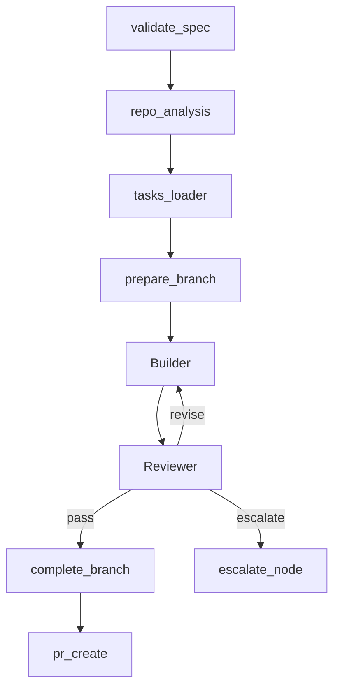

<style>
.hero {
  text-align: center;
  padding: 4rem 2rem;
  margin: -2rem -2rem 3rem -2rem;
  background: linear-gradient(135deg, #1a1a1a 0%, #7b1fa2 100%);
  color: white;
}

.hero h1 {
  font-size: 3rem;
  font-weight: 700;
  margin-bottom: 1rem;
  color: white;
  border: none;
  text-shadow: 0 2px 4px rgba(0,0,0,0.3);
}

.hero p {
  font-size: 1.25rem;
  margin-bottom: 2rem;
  color: rgba(255,255,255,0.9);
  max-width: 640px;
  margin-left: auto;
  margin-right: auto;
  line-height: 1.6;
}

.hero .md-button {
  margin: 0.5rem;
  font-size: 1rem;
  padding: 0.75rem 2rem;
  box-shadow: 0 2px 4px rgba(0,0,0,0.3);
}

.hero .md-button--primary {
  background-color: white;
  color: #4a148c;
  border: none;
  font-weight: 600;
}

.hero .md-button--primary:hover {
  background-color: #f5f5f5;
  color: #1a0050;
}

.hero .md-button:not(.md-button--primary) {
  background-color: rgba(255,255,255,0.1);
  color: white;
  border: 2px solid rgba(255,255,255,0.35);
}

.hero .md-button:not(.md-button--primary):hover {
  background-color: rgba(255,255,255,0.2);
  border-color: rgba(255,255,255,0.6);
}

@media screen and (max-width: 768px) {
  .hero h1 { font-size: 2rem; }
  .hero p { font-size: 1.1rem; }
}
</style>

<div class="hero">
  <h1>Bureau</h1>
  <p>Autonomous ASDLC runtime. Approve a spec — get back a pull request.</p>
  <p>
    <a href="getting-started/" class="md-button md-button--primary">Get Started</a>
    <a href="concepts/ralph-loop/" class="md-button">How It Works</a>
    <a href="https://github.com/fancy-bread/bureau" class="md-button">GitHub</a>
  </p>
</div>

---

## What It Is

Bureau is a Python runtime that executes an approved spec autonomously, from branch creation through to a pull request ready for human review. The developer's job ends at spec approval and resumes at PR review.

It is not a code assistant, a copilot, or a chat interface. It is a pipeline with a defined start condition (an approved spec) and a defined end condition (a merged-ready PR or a documented escalation).

---

## The Stack

| Technology | What it provides |
|---|---|
| **Spec Kit** | The upstream authoring tool. Produces the spec artifacts bureau consumes: `spec.md` (requirements), `plan.md` (architecture), and `tasks.md` (dependency-ordered implementation tasks). Bureau does not generate tasks — it executes a task list that already exists. |
| **LangGraph** | State machine backbone. The pipeline is a directed graph with checkpointed state — every node persists its output to SQLite before the next node runs. Runs are resumable from any checkpoint. |
| **deepagents** | The Builder agent runtime. Wraps an Anthropic model with filesystem tools, ASDLC skills (build / test / ship), and memory middleware. The Builder reads files, writes files, and runs commands inside the target repo. |
| **Anthropic Claude** | The LLM behind both Builder and Reviewer. Builder uses a configurable model (default `claude-sonnet-4-6`). Reviewer uses the same model with a structured output schema. |
| **CloudEvents** | Structured event envelope for all bureau output. Every significant action emits a CloudEvent — either as NDJSON to stdout (default) or published to a Kafka topic. |
| **Kafka** (optional) | Opt-in event bus. Set `BUREAU_KAFKA_BOOTSTRAP_SERVERS` to publish all CloudEvents to the `bureau.runs` topic. Enables external monitoring, dashboards, and webhooks without modifying bureau. |

---

## What It Does

A bureau run takes a spec file and a target repo path. It creates a feature branch, implements the spec, verifies the result, and opens a PR — or escalates to the developer with a clear description of what blocked it.

```
bureau run specs/001-my-feature/spec.md --repo ../my-project
```

The spec artifacts drive everything. `tasks.md` — produced by Spec Kit before bureau runs — contains the dependency-ordered implementation plan. Bureau loads it, works through it, and uses the RALPH loop to verify each phase against the functional requirements in `spec.md`.

---

## How It Works

The pipeline is a LangGraph state machine. Each node has a single responsibility and passes typed state to the next.



**Builder** implements the spec phase by phase using deepagents. It runs the test suite after each phase and commits passing work. If it cannot pass after the configured number of attempts, it escalates.

**Reviewer** runs independently of the Builder. It re-executes the full pipeline (lint → build → test), reads every changed file against the spec's functional requirements, and returns a structured verdict: `pass`, `revise`, or `escalate`. If it returns `revise`, the Builder gets another round. This cycle is the **RALPH loop**.

**Escalation** is a first-class outcome, not a failure mode. When bureau cannot proceed — exhausted retries, ambiguous spec, infra dependency — it writes a structured escalation record describing what happened, what it tried, and what the developer needs to resolve.

---

<div class="grid cards" markdown>

- **[:octicons-rocket-24: Quick Start](getting-started/quick-start.md)**

    Run bureau against a repo in five minutes.

- **[:octicons-loop-24: The RALPH Loop](concepts/ralph-loop.md)**

    Builder and Reviewer cycle in detail.

- **[:octicons-file-24: Prepare a Repo](how-to/prepare-a-repo.md)**

    Add `.bureau/config.toml` to any repo.

- **[:octicons-code-24: Development](development.md)**

    Architecture, node reference, and local dev setup.

</div>
