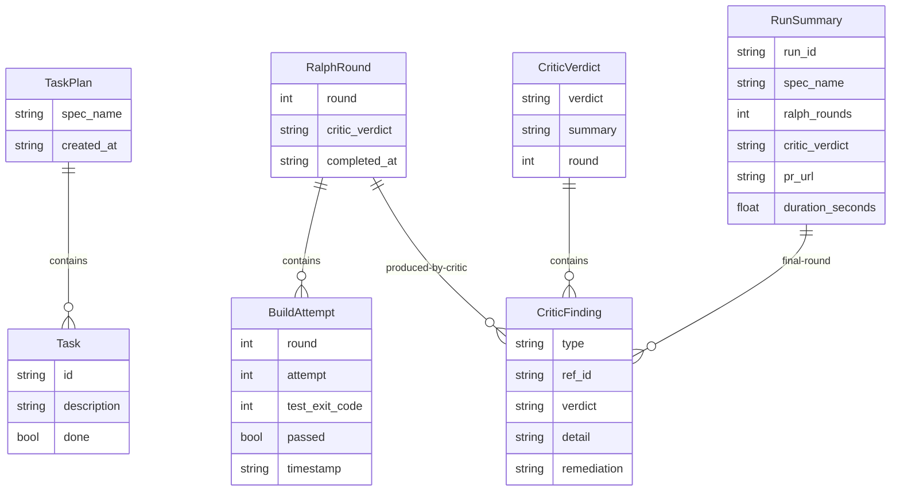
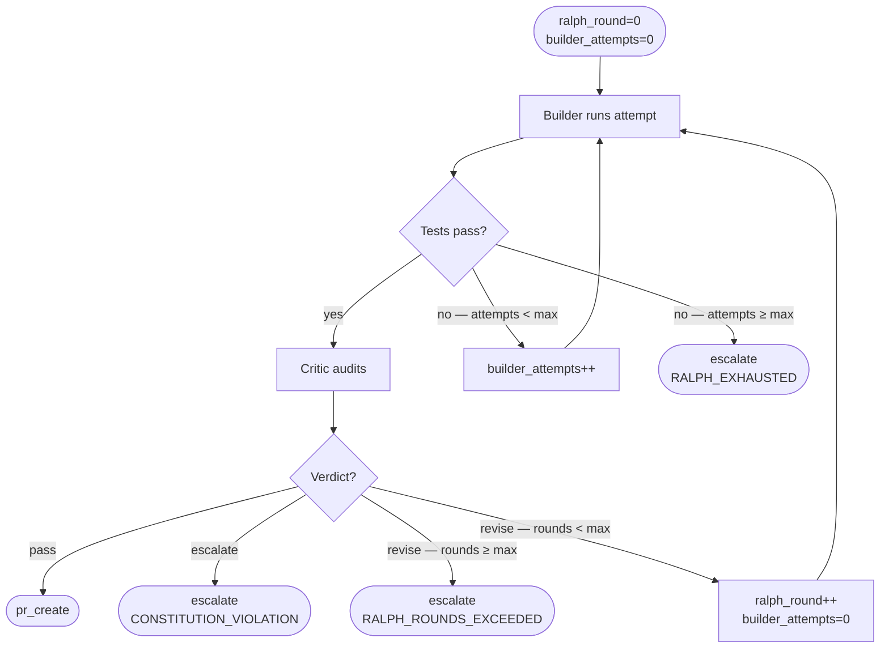

# Data Model: Bureau Personas and PR Creation

**Date**: 2026-04-18 | **Branch**: `002-personas-pr-creation`

Extends the data model established in `specs/001-autonomous-runtime-core/data-model.md`.
New types are additive; existing types are extended where noted.

---

## Entity Relationships



---

## Ralph Loop State Machine



---

## New Types

### `Task`

A single unit of work within a `TaskPlan`, produced by the Planner.

```python
@dataclass
class Task:
    id: str                        # e.g. "T001"
    description: str               # plain-language description
    fr_ids: list[str]              # functional requirement IDs this task addresses
    depends_on: list[str]          # task IDs that must complete before this one
    files_affected: list[str]      # expected file paths (relative to repo root)
    done: bool = False             # marked True by Builder when complete
```

---

### `TaskPlan`

The Planner's complete output. Written to memory under key `task_plan`.

```python
@dataclass
class TaskPlan:
    tasks: list[Task]
    spec_name: str                 # from Spec.name
    fr_coverage: list[str]         # FR IDs covered by the plan
    uncovered_frs: list[str]       # FR IDs the Planner could not map to tasks
    created_at: str                # ISO 8601
```

Validation: `uncovered_frs` MUST be empty for P1 FRs before Planner phase completes. Non-empty P1 `uncovered_frs` → escalate.

---

### `BuildAttempt`

Record of a single Builder iteration within a Ralph Loop round.

```python
@dataclass
class BuildAttempt:
    round: int                     # 0-indexed ralph_round
    attempt: int                   # 0-indexed within the round
    files_changed: list[str]       # relative paths
    test_output: str               # stdout + stderr from test_cmd (truncated to 4000 chars)
    test_exit_code: int
    passed: bool                   # test_exit_code == 0
    timestamp: str                 # ISO 8601
```

---

### `RalphRound`

Summary of one complete Builder-Critic cycle.

```python
@dataclass
class RalphRound:
    round: int                     # 0-indexed
    build_attempts: list[BuildAttempt]
    critic_verdict: str            # "pass" | "revise" | "escalate"
    critic_findings: list[CriticFinding]
    completed_at: str              # ISO 8601
```

---

### `CriticFinding`

A single finding from the Critic, scoped to one requirement or constitution principle.

```python
@dataclass
class CriticFinding:
    type: str                      # "requirement" | "constitution"
    ref_id: str                    # FR ID (e.g. "FR-005") or principle name
    verdict: str                   # "met" | "unmet" | "violation"
    detail: str                    # what was found
    remediation: str               # what the Builder must do; empty string if "met"
```

---

### `CriticVerdict`

The Critic's complete response for a round. Parsed from structured JSON output.

```python
@dataclass
class CriticVerdict:
    verdict: str                   # "pass" | "revise" | "escalate"
    findings: list[CriticFinding]
    summary: str                   # one-sentence summary for run summary / PR body
    round: int
```

Routing rules:
- `verdict == "pass"` → advance to `pr_create`
- `verdict == "revise"` → return to Builder (if `ralph_round < max_rounds`)
- `verdict == "escalate"` → always escalate regardless of round count
- `verdict == "revise"` and `ralph_round >= max_rounds` → escalate

---

### `RunSummary`

The structured artifact written to the PR description.

```python
@dataclass
class RunSummary:
    run_id: str
    spec_name: str
    spec_path: str
    branch: str
    ralph_rounds: int              # total rounds completed
    frs_addressed: list[str]       # FR IDs covered in final implementation
    critic_verdict: str
    critic_findings: list[CriticFinding]   # from final round only
    pr_url: str                    # populated after PR is created
    duration_seconds: float
    completed_at: str              # ISO 8601
```

---

## Extended Types

### `RunState` (extends existing)

New keys added to the LangGraph state dict:

| Key | Type | Description |
|-----|------|-------------|
| `task_plan` | `dict` | Serialised `TaskPlan`; written by Planner, read by Builder |
| `ralph_round` | `int` | Current 0-indexed round; incremented on each Critic `revise` verdict |
| `builder_attempts` | `int` | Attempts within current round; reset to 0 on new round |
| `build_attempts` | `list[dict]` | Serialised `BuildAttempt` list; appended by Builder each attempt |
| `ralph_rounds` | `list[dict]` | Serialised `RalphRound` list; appended by Critic on round close |
| `critic_findings` | `list[dict]` | Findings from the most recent Critic run |
| `run_summary` | `dict` | Serialised `RunSummary`; written by `pr_create` node |

All values are JSON-serialisable dicts (not dataclass instances) for LangGraph checkpoint compatibility.

---

### `BureauConfig` (extends existing)

New fields for Ralph Loop limits and model selection:

```python
@dataclass
class BureauConfig:
    # ... existing fields ...

    # Ralph Loop limits
    max_builder_attempts: int = 3   # inner loop: retries per round
    max_ralph_rounds: int = 3       # outer loop: Builder-Critic cycles

    # Model selection (configurable via bureau.toml [bureau] section)
    planner_model: str = "claude-opus-4-7"
    builder_model: str = "claude-sonnet-4-6"
    critic_model: str = "claude-opus-4-7"

    # Subprocess timeout
    command_timeout: int = 300      # seconds
```
